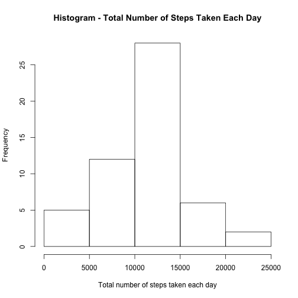
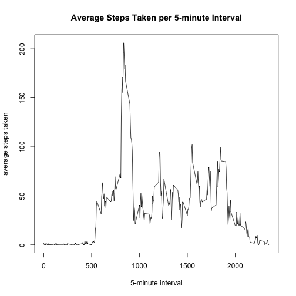
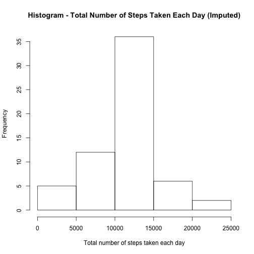
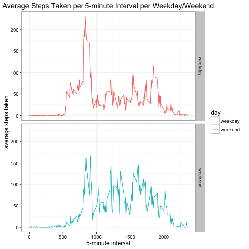

```r
## load the required libraries
library(dplyr)
library(ggplot2)
library(mice)
```

## Loading and preprocessing the data

1. Load the data (i.e. 𝚛𝚎𝚊𝚍.𝚌𝚜𝚟())


```r
## load data
url.file <- "https://d396qusza40orc.cloudfront.net/repdata%2Fdata%2Factivity.zip"
temp.dir = tempdir()
temp.file = tempfile(tmpdir=temp.dir, fileext=".zip")
download.file(url.file, temp.file, method="curl")
name.file = unzip(temp.file, list=TRUE)$Name[1]
unzip(temp.file, files=name.file, exdir=temp.dir, overwrite=TRUE)
path.file = file.path(temp.dir, name.file)
data<-read.table(path.file
                 ,header=TRUE
                 ,sep=","
                 ,na.strings="NA")
head(data)
```

```
##   steps       date interval
## 1    NA 2012-10-01        0
## 2    NA 2012-10-01        5
## 3    NA 2012-10-01       10
## 4    NA 2012-10-01       15
## 5    NA 2012-10-01       20
## 6    NA 2012-10-01       25
```

2. Process/transform the data (if necessary) into a format suitable for your analysis


```r
## remove NA from data
data.complete<-data[complete.cases(data),]
head(data.complete)
```

```
##     steps       date interval
## 289     0 2012-10-02        0
## 290     0 2012-10-02        5
## 291     0 2012-10-02       10
## 292     0 2012-10-02       15
## 293     0 2012-10-02       20
## 294     0 2012-10-02       25
```

## What is mean total number of steps taken per day?

1. Calculate the total number of steps taken per day

```r
total.steps<-data.complete %>%
    select(steps,date) %>%
    group_by(date) %>%
    summarise(total=sum(steps))
head(total.steps,10)
```

```
## Source: local data frame [10 x 2]
## 
##          date total
##        (fctr) (int)
## 1  2012-10-02   126
## 2  2012-10-03 11352
## 3  2012-10-04 12116
## 4  2012-10-05 13294
## 5  2012-10-06 15420
## 6  2012-10-07 11015
## 7  2012-10-09 12811
## 8  2012-10-10  9900
## 9  2012-10-11 10304
## 10 2012-10-12 17382
```

2. Make a histogram of the total number of steps taken each day



3. Calculate and report the mean and median of the total number of steps taken per day


```r
with(total.steps,mean(total))
```

```
## [1] 10766.19
```

```r
with(total.steps,median(total))
```

```
## [1] 10765
```

## What is the average daily activity pattern?

1. Make a time series plot (i.e. 𝚝𝚢𝚙𝚎 = "𝚕") of the 5-minute interval (x-axis) and the average number of steps taken, averaged across all days (y-axis)


```r
avg.steps<-data.complete %>%
    select(steps,interval) %>%
    group_by(interval) %>%
    summarise(avg=mean(steps))
avg.steps
```

```
## Source: local data frame [288 x 2]
## 
##    interval       avg
##       (int)     (dbl)
## 1         0 1.7169811
## 2         5 0.3396226
## 3        10 0.1320755
## 4        15 0.1509434
## 5        20 0.0754717
## 6        25 2.0943396
## 7        30 0.5283019
## 8        35 0.8679245
## 9        40 0.0000000
## 10       45 1.4716981
## ..      ...       ...
```


2. Which 5-minute interval, on average across all the days in the dataset, contains the maximum number of steps?


```r
max.steps<-with(avg.steps,which.max(avg))
avg.steps[max.steps,]
```

```
## Source: local data frame [1 x 2]
## 
##   interval      avg
##      (int)    (dbl)
## 1      835 206.1698
```

## Imputing missing values
1. Calculate and report the total number of missing values in the dataset (i.e. the total number of rows with 𝙽𝙰s)

```r
## Using "mice" package to look at missing data
## Found that only "step" column has missing data and total number of rows with NA = 2304
md.pattern(data)
```

```
##       date interval steps     
## 15264    1        1     1    0
##  2304    1        1     0    1
##          0        0  2304 2304
```

2. Devise a strategy for filling in all of the missing values in the dataset. The strategy does not need to be sophisticated. For example, you could use the mean/median for that day, or the mean for that 5-minute interval, etc.
3. Create a new dataset that is equal to the original dataset but with the missing data filled in.


```r
## Imputing strategy: substitute NA with mean for that 5-minute interval
data.impute<-data
for (i in 1:nrow(data.impute)) {
    if (is.na(data.impute$steps[i])) {
        val<-avg.steps$avg[which(avg.steps$interval==data.impute$interval[i])]
        data.impute$steps[i]<-val
    }
}
head(data.impute)
```

```
##       steps       date interval
## 1 1.7169811 2012-10-01        0
## 2 0.3396226 2012-10-01        5
## 3 0.1320755 2012-10-01       10
## 4 0.1509434 2012-10-01       15
## 5 0.0754717 2012-10-01       20
## 6 2.0943396 2012-10-01       25
```

4. Make a histogram of the total number of steps taken each day and Calculate and report the mean and median total number of steps taken per day. Do these values differ from the estimates from the first part of the assignment? What is the impact of imputing missing data on the estimates of the total daily number of steps?


```r
total.steps.impute<-data.impute %>%
    select(steps,date) %>%
    group_by(date) %>%
    summarise(total.impute=sum(steps))
head(total.steps.impute,10)
```

```
## Source: local data frame [10 x 2]
## 
##          date total.impute
##        (fctr)        (dbl)
## 1  2012-10-01     10766.19
## 2  2012-10-02       126.00
## 3  2012-10-03     11352.00
## 4  2012-10-04     12116.00
## 5  2012-10-05     13294.00
## 6  2012-10-06     15420.00
## 7  2012-10-07     11015.00
## 8  2012-10-08     10766.19
## 9  2012-10-09     12811.00
## 10 2012-10-10      9900.00
```




```r
## Impact of imputed values: 
## (1) mean value has not changed.
## (2) median value is slightly different.
with(total.steps.impute,mean(total.impute))
```

```
## [1] 10766.19
```

```r
with(total.steps.impute,median(total.impute))
```

```
## [1] 10766.19
```

## Are there differences in activity patterns between weekdays and weekends?

1. Create a new factor variable in the dataset with two levels – “weekday” and “weekend” indicating whether a given date is a weekday or weekend day.


```r
data.impute.day<-data.impute
data.impute.day$day<-as.factor(ifelse(weekdays(as.Date(data$date))=="Saturday" | weekdays(as.Date(data$date))=="Sunday","weekend","weekday"))
str(data.impute.day)
```

```
## 'data.frame':	17568 obs. of  4 variables:
##  $ steps   : num  1.717 0.3396 0.1321 0.1509 0.0755 ...
##  $ date    : Factor w/ 61 levels "2012-10-01","2012-10-02",..: 1 1 1 1 1 1 1 1 1 1 ...
##  $ interval: int  0 5 10 15 20 25 30 35 40 45 ...
##  $ day     : Factor w/ 2 levels "weekday","weekend": 1 1 1 1 1 1 1 1 1 1 ...
```

2. Make a panel plot containing a time series plot (i.e. 𝚝𝚢𝚙𝚎 = "𝚕") of the 5-minute interval (x-axis) and the average number of steps taken, averaged across all weekday days or weekend days (y-axis).


```r
avg.steps.day<-data.impute.day %>%
    select(steps,interval,day) %>%
    group_by(day,interval) %>%
    summarise(avg.day=mean(steps))
avg.steps.day
```

```
## Source: local data frame [576 x 3]
## Groups: day [?]
## 
##        day interval    avg.day
##     (fctr)    (int)      (dbl)
## 1  weekday        0 2.25115304
## 2  weekday        5 0.44528302
## 3  weekday       10 0.17316562
## 4  weekday       15 0.19790356
## 5  weekday       20 0.09895178
## 6  weekday       25 1.59035639
## 7  weekday       30 0.69266247
## 8  weekday       35 1.13794549
## 9  weekday       40 0.00000000
## 10 weekday       45 1.79622642
## ..     ...      ...        ...
```


#### Average number of steps on the weekends seem to be slightly less than on the weekdays.
